<table>
<tr>
<td valign="top"></td>
<td valign="top"></td>
</tr>
</table>

## MUHAMMAD SHOAIB

**AI/ML Engineer · Full-Stack Developer · Application Developer · Computer Engineer**

 

<!-- animated contribution graph, refreshed daily by the workflow -->

